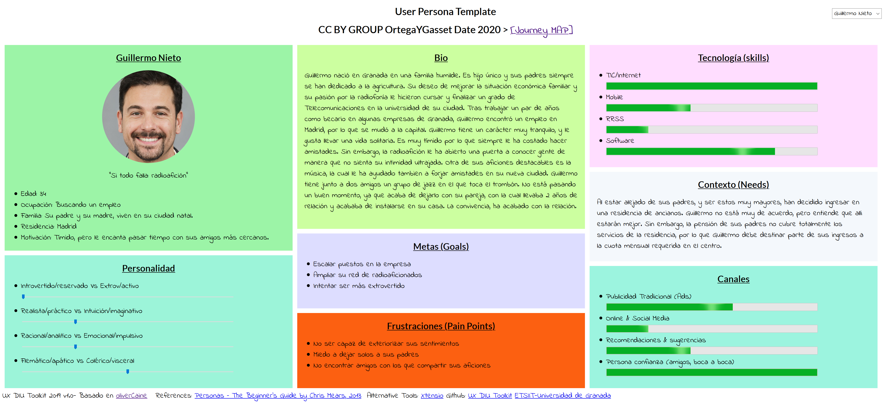

## DIU - Practica1, entregables

>>> *Desk research: Análisis Competencia*

Los servicios que hemos encontrado contra los que competir son:
  - HABITOOM: Es una web. Aunque su funcionamiento parece simple, a la hora de buscar anuncios se convierte en una tarea muy compleja. Necesita ubicaciones muy concretas por lo que dificulta la busqueda. Comunidad sin apenas feedback.
  - STUKERS: También es una web. En el anuncio tienes la posibilidad de ver a los compañeros que ya estan conviviendo. SU mayor desventaja son las escasas opciones de filtrado en la búsqueda. Es tan básico que no a todos los usuarios sirve.
  - BADI: Es tanto una web como una app. La hemos encontrado la más completa, por su sistema de filtrado, su comunidad, las opcioens de perfil, y lo sencillo que a priori parece su uso. Es por ello que vamos a escogerla para hacerle el Usability Review, ya que nos parece la competencia más alta contra la que competimos.

>>> *2 Personas* 

Hemos elegido a estas personas porque ambos reunen características básicas de los usuarios frecuentes en estos servicios pero, a su vez, presentan necesidades muy dispares y concretas como la nacionalidad o la dificultad de encontrar un compañero afin para ellos. Tienen habilidades de usuario diferentes por lo que nos permite abordar el estudio de la usabilidad desde puntos de vista muy distintos.

>>> *2 User Journey Map*  ( 1 por persona)

Ashley: Ella necesita una habitación en la que vivir durante su estancia en granada. Durante la búsqueda en el serviico, se encuentra con un problema y se ve obligada a reportar una habitación.

Guillermo: Quiere publicar un anuncio de habitación para buscar compañeros para sacar un dinero extra. Necesita que tengan unas personalidades afines a la suya.

Se trata de las dos funcionalidades principales que ofrece el servicio, por lo que todos los usuarios de badi las van a usar. Además por las caracteristicas de las personas, vamos a testar otras funionalidades del servicio como el soporte tecnico o la utilidad de los perfiles.

- Revisión de Usabilidad 
