# DIU - Practica2, entregables

## Malla receptora de información 
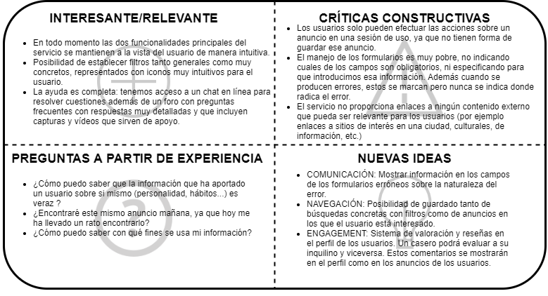

Nuestro servicio se llama Sharee y para mejorar el servicio de badi implementará funcionalidades relacionadas con:
- Guardado de búsquedas con filtros
- Marcado de anuncios como favoritos
- Sistema de valoración y reseña de usuarios

## Sitemap & Task flow 
**2.1 Sitemap**
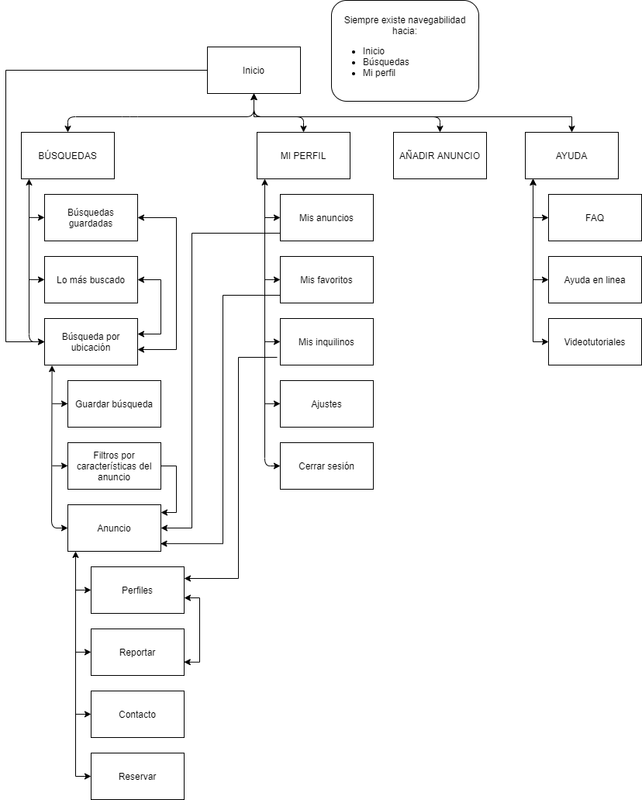

**2.2 Task Flow**

Favoritos:
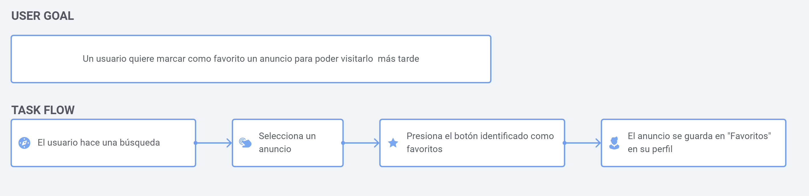
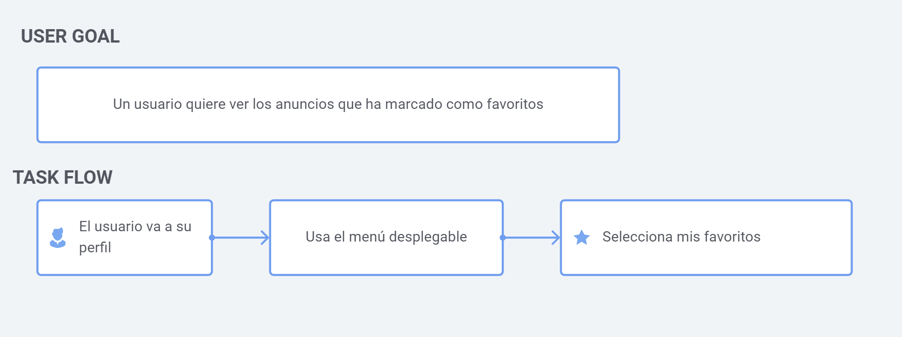

Búsqueda:
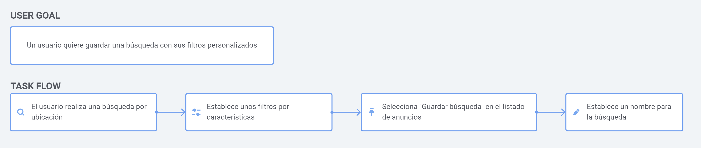

Reseñas:
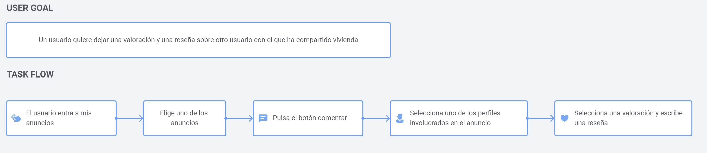
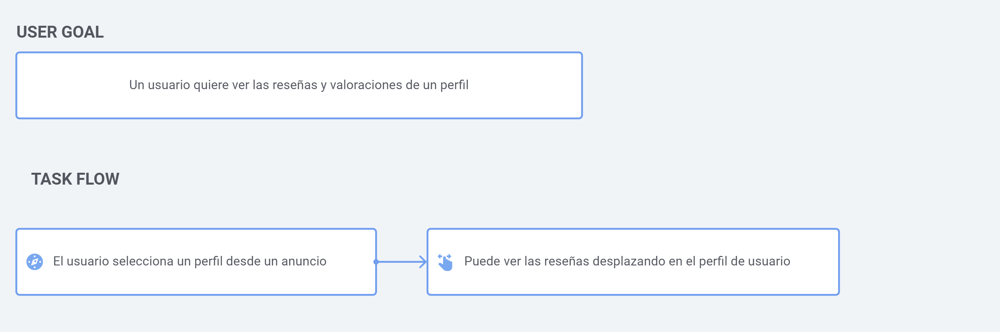

## Labelling 

Puedes ver toda la información acerca del labelling en [este documento pdf](https://github.com/romanlarrosa/DIU20/tree/master/P2/doc/labelling.pdf)

## Wireframe & User flow 

Favoritos:
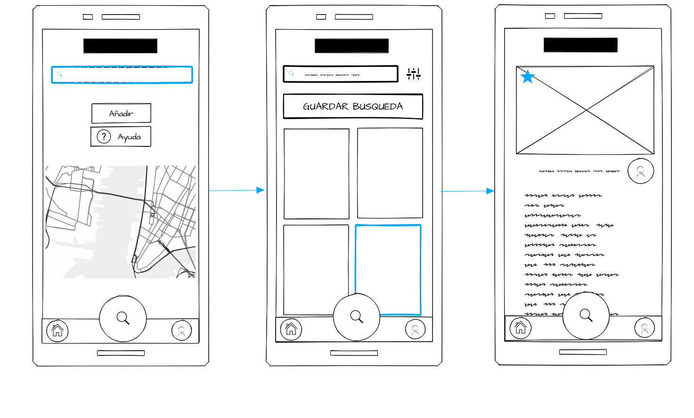
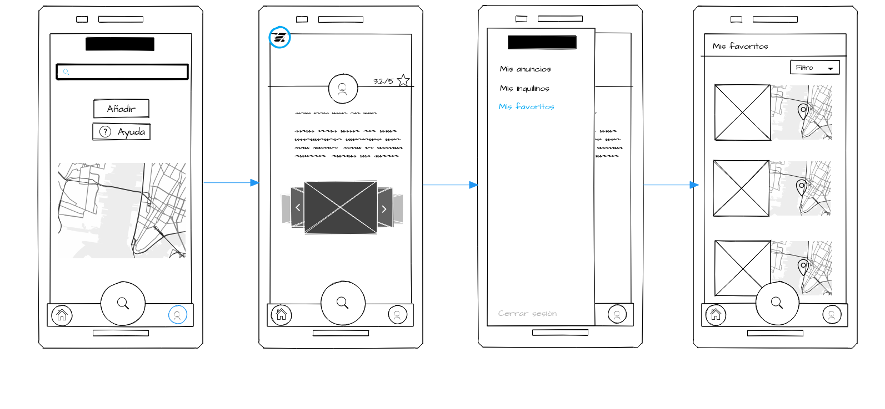

Búsqueda:
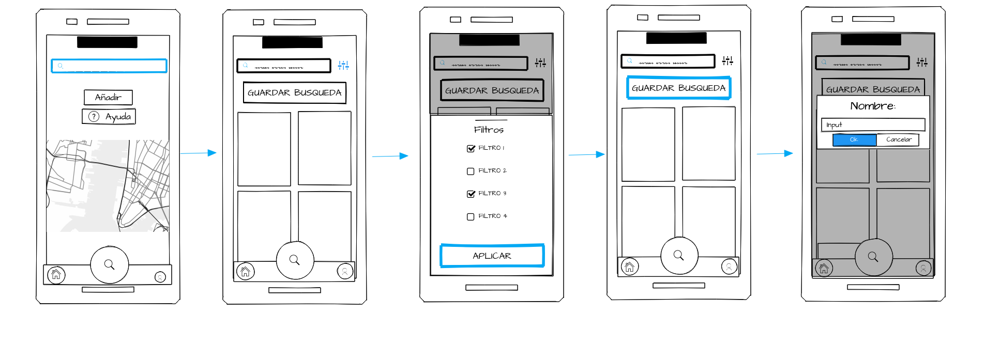

Reseñas:
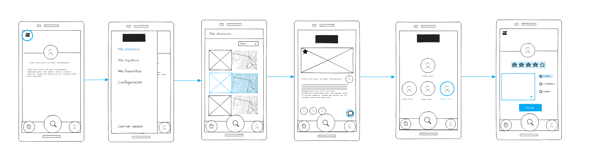
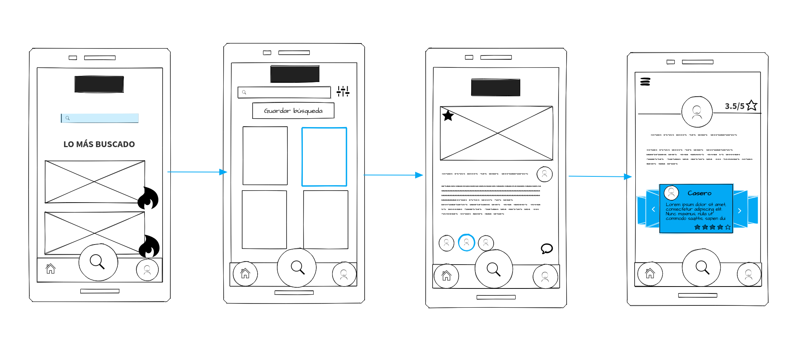

